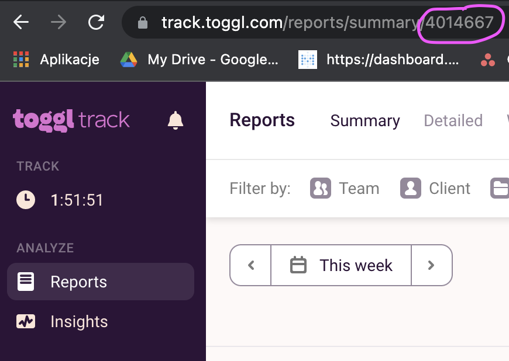

# toggl-monthly-reports
Download monthly reports from toggl.

## Requirements
* python

## Install
Create venv and activate:
`python -m venv venv/`  
`source venv/bin/activate`

Install requirements:
`pip install -r requirements.txt`

## Set-up
First, set constant variables at the top of the file:
* USERNAME (_required_): your toggle username 
* PASSWORD (_required_): your toggle password
* WORKSPACE_ID (_required_): id of the toggl workspace your want generate report of. You can get it by going to https://track.toggl.com/timer, choosing _Report_ from the sidebar and copying the number from the url:

* HANDLE: your nickname, appearing in the filename eg. ak
* COMPANY: company name, appearing in the filename eg. QED

## Run
`python toggl.py`

will generate 3 reports for the previous month:
* summary pdf report
* summary csv report
* detailed csv report

It will also perform a series of checks:
* check if there are any entries without description
* check if there aren't any suspiciously long entries (>8h)
* check if there aren't any overlapping entries  

Not passing a check will display a warning but continue with report generation. 

`python toggl.py 1 2020` will generate 3 reports for January 2020.
